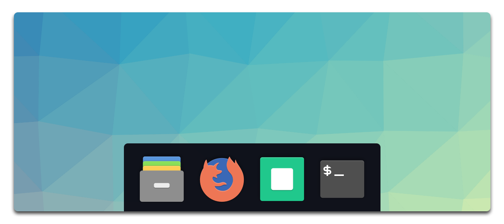

<h1 align="center">
Oceandock
</h1>

<h4 align="center">
  Deep oceanic blue Plank dock theme
</h4>

<div align="center">
  
</div>

<p align="center">
  <a href="https://travis-ci.com/klaussinani/oceandock">
    
  </a>
</p>

## Contents

- [Install](#install)
- [Usage](#usage)
- [Extra](#extra)
- [Related](#related)
- [Team](#team)
- [License](#license)

## Install

```bash
npm install --global oceandock
```

## Usage

```
$ oceandock --help

  Deep oceanic blue Plank dock theme

  Usage
    $ oceandock [option]

  Options
    --help, -h        Display help message
    --install, -i     Install theme
    --uninstall, -u   Uninstall theme
    --reinstall, -r   Reinstall theme
    --version, -v     Display installed version

  Examples
    $ oceandock
    $ oceandock --install
    $ oceandock --uninstall
    $ oceandock --version
    $ oceandock --help
```

## Extra

- App icons are from the [Papirus Icon Theme](https://github.com/PapirusDevelopmentTeam/papirus-icon-theme)
- Wallpaper was created with [trianglify.io](https://trianglify.io/)

## Related

- [hyperocean](https://github.com/klaussinani/hyperocean) - Hyper Terminal version
- [itermocean](https://github.com/klaussinani/itermocean) - iTerm version
- [ocean-space](https://github.com/oscarmcm/ocean-space) - Visual Studio Code version

## Team

- Klaus Sinani ([@klaussinani](https://github.com/klaussinani))

## License

[MIT](license.md)
